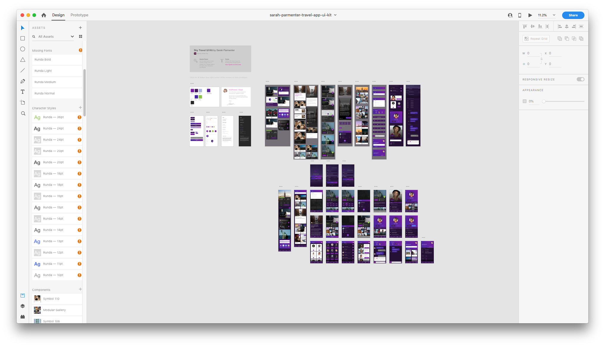
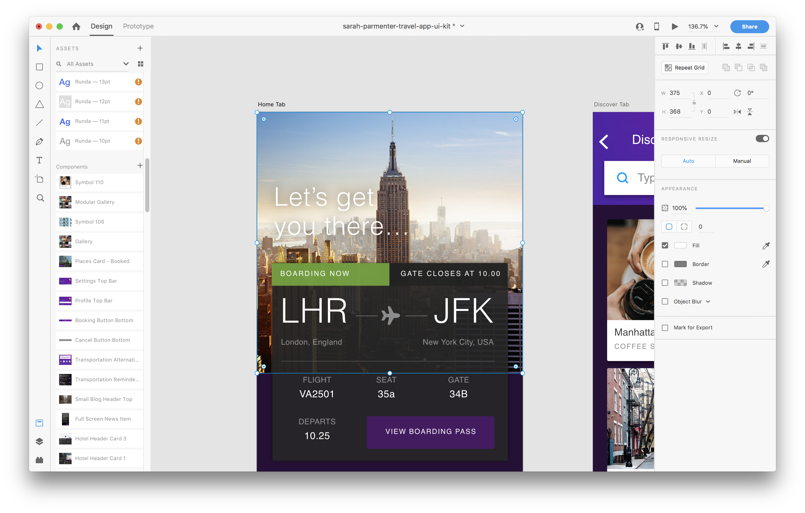

# Intro to Adobe XD

Out in the real world, developers are given assignments (called tickets) by a
project manager. If the ticket is to build out a new feature or rebuild an
existing piece of an application, then it will (hopefully) include a mock-up
from a designer.

Designers use a lot of different tools to create mock-ups: Photoshop, Sketch,
Figma, Adobe XD.

Different companies and teams will prefer different tools or sets of tools.
However, no designer is going to package up everything you need to build out
their design. Designers are not nice people. Or maybe they're just too busy, who
knows. Anyway, you will be responsible for exporting the things you need from
the design file.

## Prerequisites

- Patience

## Objectives

By the end of this, developers should be able to:

- Navigate around Adobe XD
- Identify color and font variations in an Adobe XD file
- Export images and other assets from Adobe XD

## Preparation

1. [Download Adobe XD](https://www.adobe.com/products/xd.html)
1. Download the
   [`sarah-parmenter-travel-app-ui-kit.xd`](https://drive.google.com/drive/folders/1d89lhVfRE-WTTkVmZ27xcuCBWT0KSBKA?usp=sharing)
   mock-up
1. Open up the mock in XD

## Introduction

We're going to introduce you to Adobe XD and walk through some basic tasks
you'll need to do as part of your job as a developer including:

1. Navigating through layers
1. Identifying color and font variations
1. Exporting assets like images and icons

Hopefully the designers you work with have good
[photoshop etiquette](https://photoshopetiquette.com). In our experience, most
do not. That means that you may have to spend a bit of time getting everything
you need from a design file. That said, they're all really similar. So once
you've learned one, you've learned them all.

## Navigating Around XD

When you first open an Adobe XD file, you should see something that looks like
this:

There are a couple of pieces to this interface:

1. **Artboards:** Each of the blocks in the middle that show a piece of the user
   interface is an artboard. Designers will use artboards to mock up screens of
   the application or pieces of the UI. They will (hopefully) also use artboards
   to provide some context and documentation.
1. **Assets Panel:** The left side panel has three options: Assets, Layers,
   and Plugins. Assets and Layers are the only options we'll care about. The
   Assets Panel lists all the assets in the design: colors, fonts, font styles,
   components (sometimes also called symbols).
1. **Configuration Panel:** The right side panel is for configuring the
   appearance of an element on the page. For us, it's for figuring out how
   something looks (for our CSS).
1. **Layer Panel:** An artboard is made up of multiple layers. Each layer is
   made up of a grouping of elements. Sometimes, you'll need to dig through the
   layers to find the asset you want. Hopefully you can get there by clicking on
   it though!

## Exporting Assets

Let's focus on this screen:

This screen has a header image and an icon that we'll need to export in order to
include them in our application.

In XD, we can either export assets one at a time or in batch. Hopefully the
designer has marked assets for export before us. Know that they probably
haven't.

### Export Individual Assets

Click until the asset is selected. You'll know it's selected when it's outlined.
Having the layer panel open here is helpful too, because the asset will be
highlighted in the panel if it's selected.

When the asset is selected go to File > Export > Export Selected (or use the
shortcut: Command + E). This will open the file viewer. Save the file to your
desktop and move it to your project, or navigate to your project and save it
there directly.

### Batch Export Assets

XD lets you batch export assets that have been marked for export. First, go
through the mock and select "Mark for Export" for each asset you want to export.
You can either do this in the configuration panel on the right or by selecting
the export icon next to the item in the Layer panel. You can also do this by
right clicking on the asset and selecting "Mark for Export".

Once you've selected all the assets you want to export, create the export from
File > Export > Batch (or use the shortcut: Command + Shift + E).

### Export Tips

* When you export, select 'Web' for the "Export For" option
* Export images as PNG files and icons as SVG
* If you can export high definition images, do so and use an image optimizer.
* If the image has some effect on it, export the raw image and apply the affect
    with CSS, if you can!

## Identifying Colors and Fonts

Adobe XD Makes it pretty easy for us to extract colors and fonts from a design.
The Asset panel lists all the colors, fonts, and font styles used in a design.

### Getting Colors

To get the hex code for a color, right click on it in the asset panel and select
"Copy <hex code>".

### Getting Font Styles

Right click on the font style in the Asset panel and select "Highlight on
Canvas". This will highlight every instance of this font. From there, click on
any instance of that font style and the right configuration panel will show you:
the font, font size, font style, letter spacing, line height, after margin,
color, etc. Put all that info into a CSS class and you're done!

## Conclusion

We've covered everythin you'll need to work with design files. It's up to you to
come up with a workflow that works for you. You goal is to make it look like the
mock. It's up to you to figure out the best way to do that!

## Additional Resources

- Any useful links should be included in the talk material where the link is
  first referenced.
- Additional links for further study or exploration are appropriate in this
  section.
- Links to important parts of documentation not covered during the talk, or
  tools tangentially used but not part of the focus of the talk, are also
  appropriate.

## [License](LICENSE)

1. All content is licensed under a CC­BY­NC­SA 4.0 license.
1. All software code is licensed under GNU GPLv3. For commercial use or
   alternative licensing, please contact legal@ga.co.
